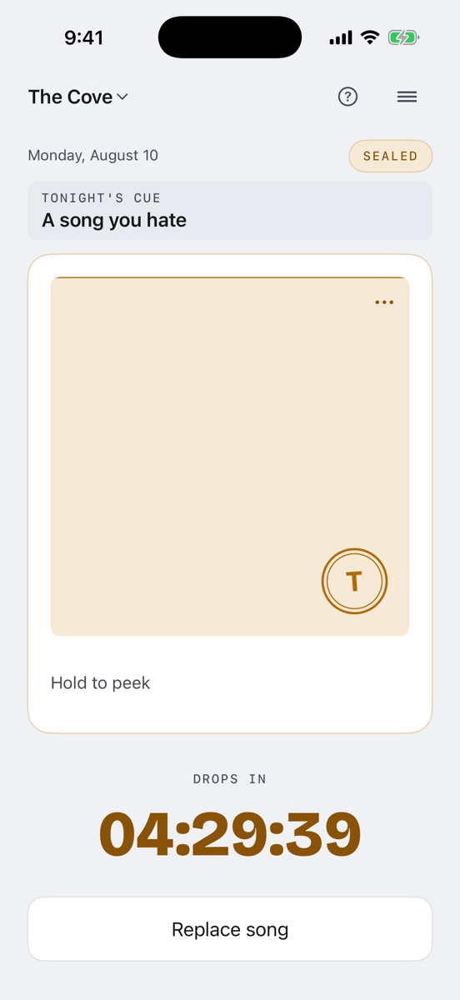
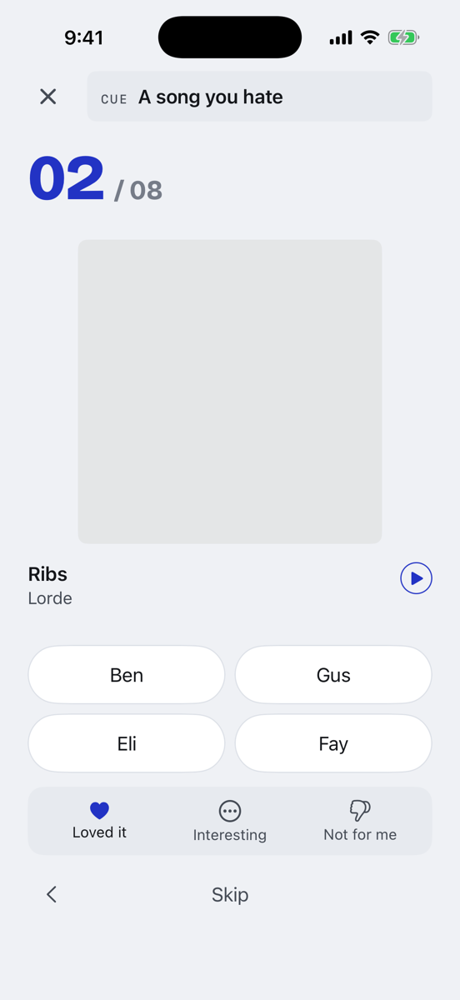
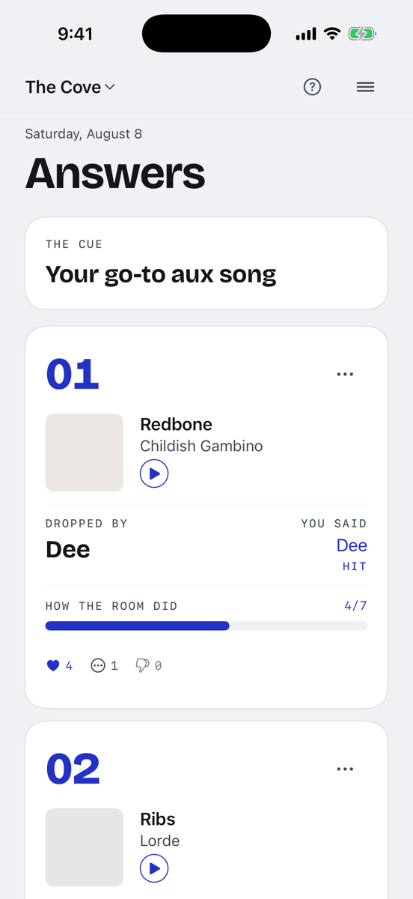
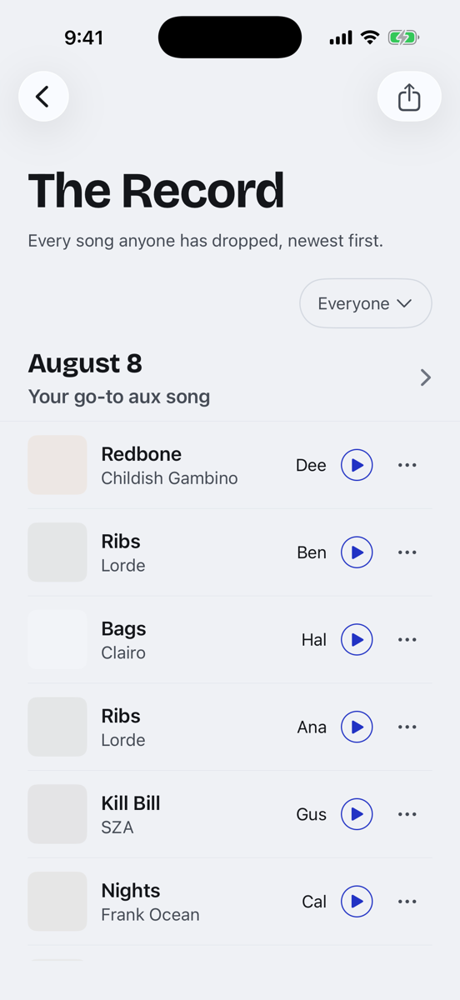

# Blind Drop

A daily music-guessing game for iOS. Everyone in a friend group drops one song in secret, then everyone guesses who picked what. Site: [blinddrop.app](https://blinddrop.app).

<p>
  
  
  
  
</p>

## Why I made it

Music taste says a lot about people, and my friends and I were always arguing about who would pick what. I wanted a game that turned that argument into a nightly ritual. It has been on TestFlight for about a month. Around 15 friends play every day, with 6 to 8 songs dropped on a typical night.

## How a day works

1. **Drop.** During the day everyone picks one song. The pick is sealed: nobody can see what anyone else chose, or even whether they have played yet.
2. **Reveal.** At 8 PM the songs appear as an anonymous numbered list, and everyone has two hours to guess who dropped each one.
3. **Answers.** At 10 PM the answers land. **Ear** is how many songs you have placed correctly over the group's last 14 rounds, and it is what the standings rank on. **Readability** is how much of the room guessed your song right.

Every song goes into **The Record**, a running archive that exports to a Spotify or Apple Music playlist.

## How it's built

- **iOS:** SwiftUI, Swift 6 with strict concurrency, iOS 17.4+. No third-party packages.
- **Backend:** Supabase Postgres with hand-written Deno Edge Functions. A `pg_cron` job ticks every minute and moves each group's round through its phases.
- **Music:** song search goes through a server-side Apple Music proxy, and each track is matched to Spotify by ISRC so exports work on either service.
- **Push:** APNs, sent from an outbox table so a failed send can be retried.

A few decisions I care about:

- **The server owns the clock.** The app never decides what phase it is. Changing your phone's time or timezone does nothing.
- **The blind window is enforced in the API, not the UI.** While songs are sealed, no response contains another player's song, a submission count, or anything you could work one out from. I turned off Supabase's auto-generated REST API for clients because it leaks row counts through response headers. `npm run audit:leak` checks all of this with golden-payload tests plus response-size and timing checks.
- **Tested at every layer.** 819 pgTAP assertions on the database, Deno tests on every Edge Function, and 700+ iOS unit and snapshot tests. The snapshots render at several Dynamic Type sizes.
- **Written down first.** [`docs/`](docs) has the specs I build from: data model, API contract, threat model, scoring rules, and motion.

## Running it

You need Docker, Node 22+, and Xcode 26.

**Backend and tests.** This starts a local Supabase stack on ports 54421 to 54424, so it won't collide with another local project.

```bash
cd server
npm install
npm run db:start
npm test
```

**The app, without the backend.** `ios/Fixtures/server.ts` serves canned responses for every endpoint. `PHASE` can be `open`, `revealed`, or `scored`.

```bash
cd ios/Fixtures
PHASE=revealed ../../server/node_modules/.bin/deno run --allow-net --allow-read --allow-env server.ts
```

Then, in a second terminal from the repo root:

```bash
xcodebuild -project ios/BlindDrop.xcodeproj -scheme BlindDrop -destination 'platform=iOS Simulator,name=iPhone 17 Pro' -derivedDataPath build build
xcrun simctl boot "iPhone 17 Pro"
xcrun simctl install booted build/Build/Products/Debug-iphonesimulator/BlindDrop.app
xcrun simctl launch booted com.blinddrop.app -apiBaseURL http://127.0.0.1:8787 -fixtureSession
```

Or in Xcode, add `-apiBaseURL http://127.0.0.1:8787 -fixtureSession` to the scheme's launch arguments and press Run.

The full reference (scheduler settings, secrets, and test details) is in [`docs/LOCAL-SETUP.md`](docs/LOCAL-SETUP.md).

## What's next

- Get it on the App Store. The remaining release checks need real hardware: an Instruments pass on the reveal animations, and confirming that tapping a notification opens the right screen on a physical phone.
